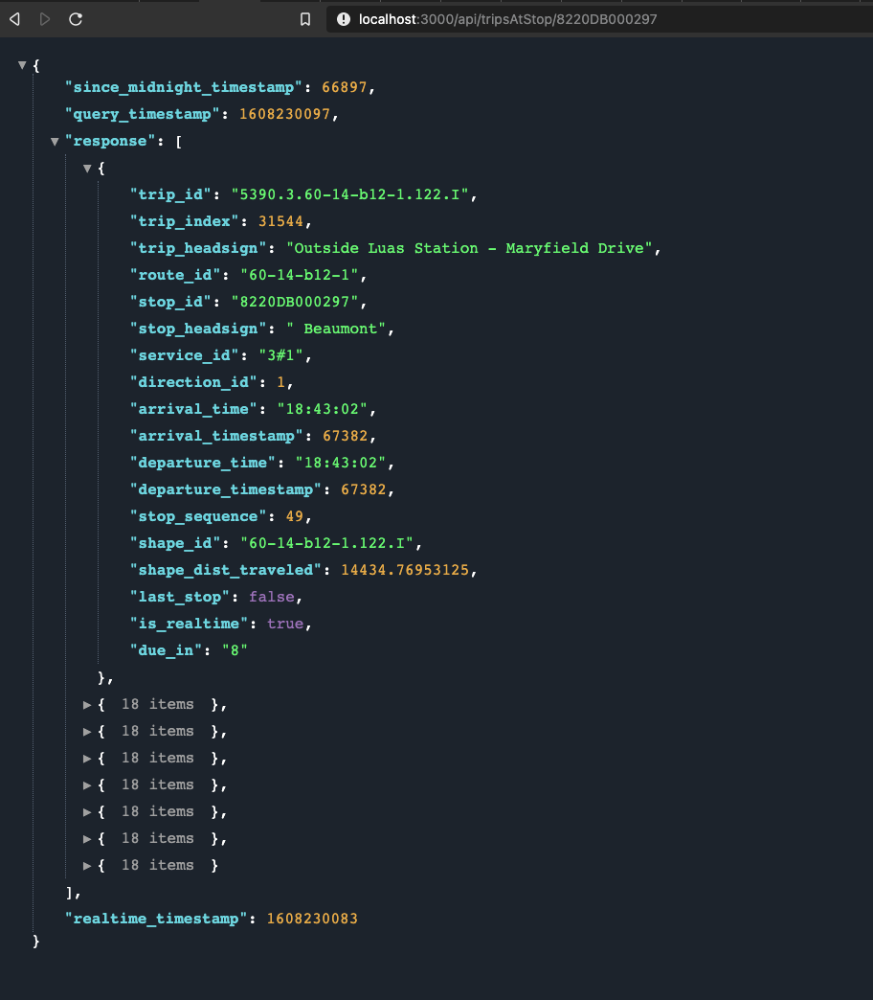
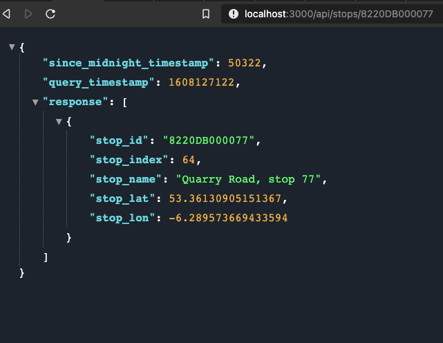
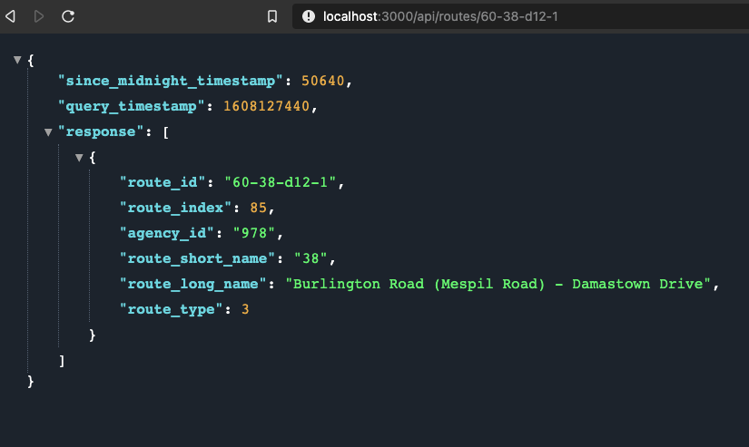
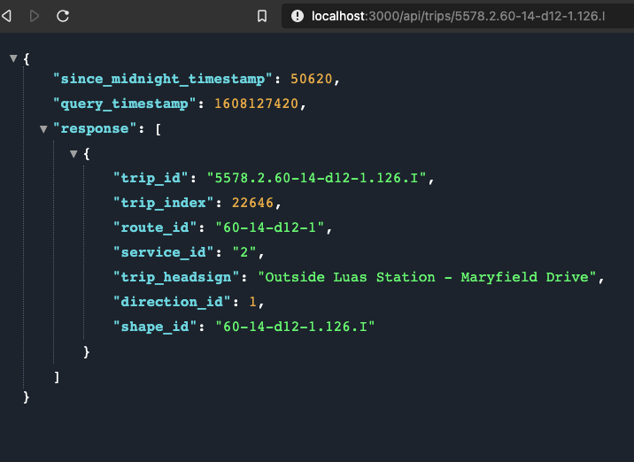
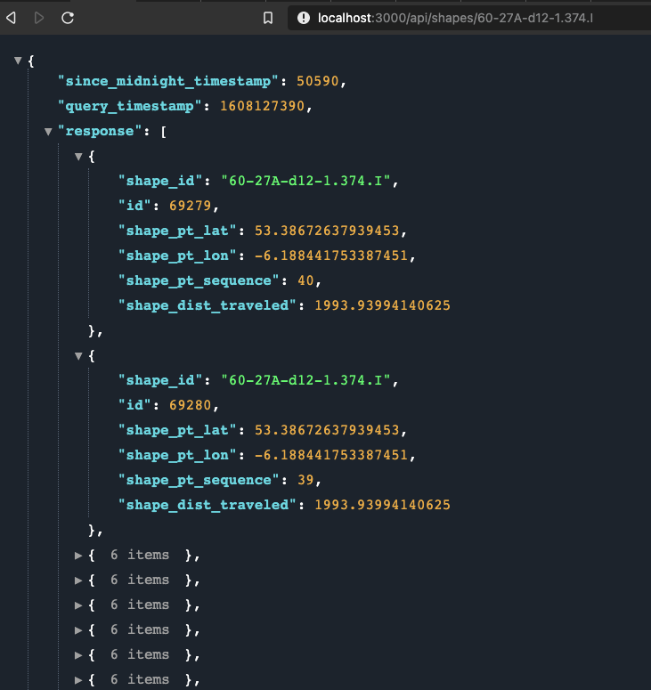
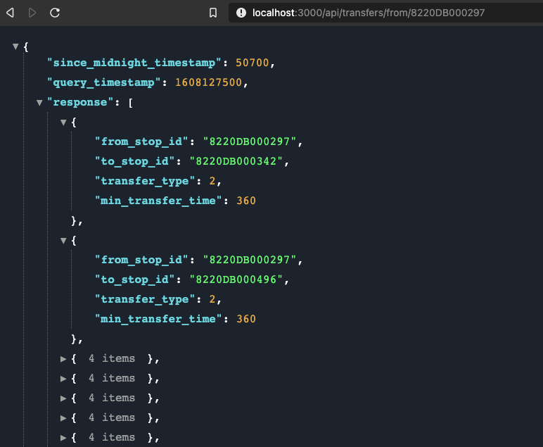
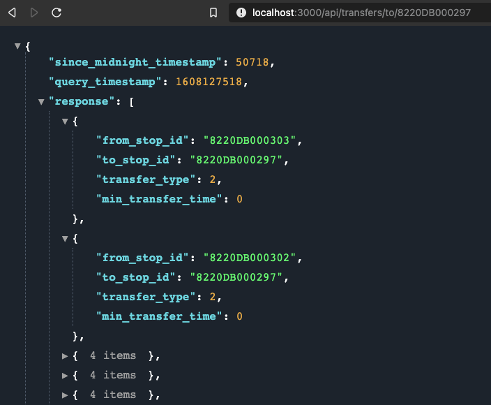

# Realtime-Transport-Updates-API
`Realtime-Transport-Updates-API` is a Node.js application that loads a [Transport For Ireland GTFS feed](https://www.transportforireland.ie/transitData/PT_Data.html) into an MSSQL docker container and exposes REST API's to consume both static GTFS schedule data and realtime updates from the [NTA GTFS-Realtime API](https://developer.nationaltransport.ie/api-details#api=gtfsr&operation=gtfsr). 

It provides queries to get incoming trips at a provided stop, stop locations, routes, queries and route shapes.

**This application is made for usage with Irish transit agency GTFS feeds and the NTA GTFS-Realtime API**, however with changes to SQL queries and the realtime plugin it can be used for transit agencies elsewhere.

## Requirements
* Nodejs v15+
* Docker

## Setup
### Docker Setup
#### Setup an MSSQL Docker container

The application downloads a GTFS feed and writes it to a [Microsoft SQL Server Docker image](https://hub.docker.com/_/microsoft-mssql-server).

In `docker-compose.yml` provide a password for the database:

```
SA_PASSWORD: 'YOUR_PASSWORD_HERE'
```

In the project root directory run the docker-compose file which downloads the image and runs the container:

```
docker-compose up -d
```
#### Download and write the GTFS feed to your Docker container
Replace the below section of `.env` with your own configuration:

```
# Docker SQL server container
DOCKER_SQL_USER=sa
DOCKER_SQL_PASSWORD=YOUR_PASSWORD_HERE
DOCKER_SQL_SERVER=localhost
DOCKER_SQL_DATABASE=gtfsdb
```
In `src/import/config.js` add your own agency and the url of the GTFS feed you wish to download.

Once you have added your own configuration import the GTFS feed into your Docker container with the following command:

```
npm run import
```

## Conifguration
In `.env` replace the placeholders in the Docker SQL server container and GTFS-R API sections with your own configuration settings.

To use the NTA GTFS-Realtime API you will need to sign up and obtain an API key [here](https://developer.nationaltransport.ie/signup)

#### Azure SQL server configuration

If your GTFS feed is on an Azure SQL server you can specify your server config in the appropriate section.

## Usage

### Run the Application

You can run the application on the GTFS-R API test URL using:

```
npm start
```
Run the application on the GTFS-R API production URL using:

```
npm run prod
```

## Endpoints
The below screenshots show sample query responses providing results from the GTFS static dataset, updated with realtime data where possible.

### /api/tripsAtStop/`<stop_id>`
- `since_midnight_timestamp`: Timestamp of the query as the number of seconds elapsed since midnight.
- `query_timestamp`: Unix timestamp at the time of the query
- `last-stop`: Indicates whether this stop is the last stop on the trip.
- `is_realtime`: Will be `true` if result is updated with an update from the GTFS Realtime API, otherwise `false` and using the static schedule data.
- `due_in`: The number of minutes until the scheduled arrival of the trip at the queried stop.
- `realtime_timestamp`: Unix timestamp of the moment a response was received from the GTFS Realtime API.



### /api/stops/`<stop_id>`
- `since_midnight_timestamp`: Timestamp of the query as the number of seconds elapsed since midnight.
- `query_timestamp`: Unix timestamp at the time of the query



### /api/routes/`<route_id>`
- `since_midnight_timestamp`: Timestamp of the query as the number of seconds elapsed since midnight.
- `query_timestamp`: Unix timestamp at the time of the query



### /api/trips/`<trip_id>`
- `since_midnight_timestamp`: Timestamp of the query as the number of seconds elapsed since midnight.
- `query_timestamp`: Unix timestamp at the time of the query



### /api/agencies/`<agency_id>`
- `since_midnight_timestamp`: Timestamp of the query as the number of seconds elapsed since midnight.
- `query_timestamp`: Unix timestamp at the time of the query


### /api/shapes/`<shape_id>`
- `since_midnight_timestamp`: Timestamp of the query as the number of seconds elapsed since midnight.
- `query_timestamp`: Unix timestamp at the time of the query



### /api/transfers/from/`<stop_id>`
- `since_midnight_timestamp`: Timestamp of the query as the number of seconds elapsed since midnight.
- `query_timestamp`: Unix timestamp at the time of the query



### /api/transfers/to/`<stop_id>`
- `since_midnight_timestamp`: Timestamp of the query as the number of seconds elapsed since midnight.
- `query_timestamp`: Unix timestamp at the time of the query



### /api/tripsAtStop/`<stop_id>`
- `since_midnight_timestamp`: Timestamp of the query as the number of seconds elapsed since midnight.
- `query_timestamp`: Unix timestamp at the time of the query


## Testing

### Run Tests
The following runs tests on the application:

```
npm test
```
